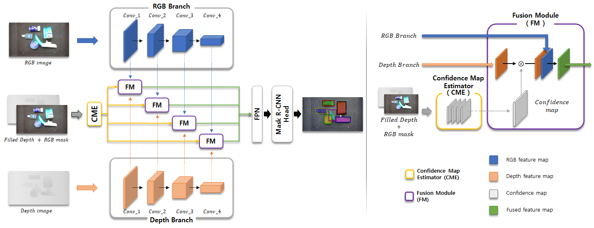
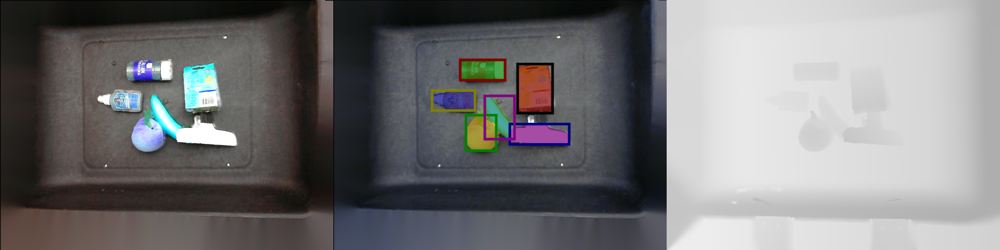
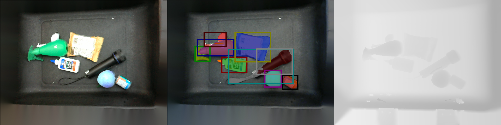
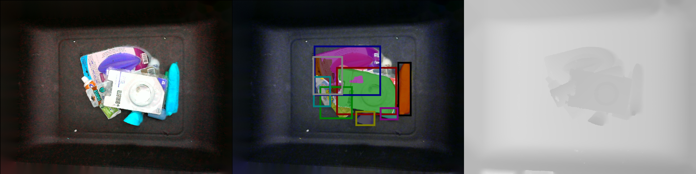

# Synthetic RGB-D Fusion (SF) Mask R-CNN

Synthetic RGB-D Fusion (SF) Mask R-CNN for unseen object instance segmentation

> S. Back, J. Kim, R. Kang, S. Choi and K. Lee. **Segmenting unseen industrial components in a heavy clutter using rgb-d fusion and synthetic data.** 2020 IEEE International Conference on Image Processing (ICIP). IEEE, 2020. [[Paper]](https://ieeexplore.ieee.org/abstract/document/9190804) [[Video]](https://youtu.be/eB4LKfYZwYo)


## SF Mask R-CNN
---
Unseen object instance segmentation performance on [WISDOM](https://sites.google.com/view/wisdom-dataset/dataset_links) dataset 

|               Method              |   Input   | Use Synthetic Data |    Backbone   | mask AP | box AP |     Reference     |
|:---------------------------------:|:---------:|:------------------:|:-------------:|:-------:|:------:|:-----------------:|
|           SD Mask R-CNN           |   Depth   |     Yes (WISDOM)   | ResNet-35-FPN |   51.6  |    -   | [Danielczuk et al.](https://ieeexplore.ieee.org/abstract/document/8793744) |
|             Mask R-CNN            |    RGB    |         No         | ResNet-35-FPN |   38.4  |    -   | Danielczuk et al. |
|             Mask R-CNN            |    RGB    |         No         | ResNet-50-FPN |   40.1  |  36.7  |     [Ito et al.](https://openaccess.thecvf.com/content/ACCV2020/html/Ito_Point_Proposal_based_Instance_Segmentation_with_Rectangular_Masks_for_Robot_ACCV_2020_paper.html)    |
|               D-SOLO              |    RGB    |         No         | ResNet-50-FPN |   42.0  |  39.1  |     Ito et al.    |
|               PPIS                |    RGB    |         No         | ResNet-50-FPN |   52.3  |  48.1  |     Ito et al.    |
|    SF Mask R-CNN (early fusion)   | RGB-Depth |      Yes (Ours)    | ResNet-50-FPN |   55.5  |  57.2  |        [Ours](https://ieeexplore.ieee.org/abstract/document/9190804)       |
|    SF Mask R-CNN (late fusion)    | RGB-Depth |      Yes (Ours)    | ResNet-50-FPN |   58.7  |  59.0  |        Ours       |
|**SF Mask R-CNN (confidence fusion)**| RGB-Depth |      Yes (Ours)    | ResNet-50-FPN | **60.5**|**61.0**|        Ours       |



 

**SF Mask R-CNN** is an upgraded version of RGB-D fusion Mask R-CNN with a confidence map estimator [1].
The main differences from [1] are
- SF Mask R-CNN generates a self-attention map from RGB and inpainted depth (validity mask and raw depth were used in [1]) 
- This self-attention map is used as a confidence map; Thus, RGB and depth feature maps fused with spatial self-attention in four different scales.
- It was fined-tuned on WISDOM-REAL-Train (100 images) and evaluated on public unseen object instance segmentation dataset, WISDOM (The only custom industrial dataset was used previously)


## Updates
- SF Mask R-CNN has been released (2020/02/18)
- Paper extended from [1] with the detailed description, synthetic data, and robot demo will be publicly available soon... Stay tuned!


## Getting Started
---
### Environment Setup

1. Setup anaconda environment
```
$ conda create -n sfmaskrcnn python=3.7
$ conda activate sfmaskrcnn
$ pip install torch torchvision
$ pip install imgviz tqdm tensorboardX pandas opencv-python imutils pyfastnoisesimd scikit-image pycocotools
$ pip install pyrealsense2 # for demo
$ conda activate sfmaskrcnn
```

2. Download the provided SF Mask R-CNN weights pre-trained on our custom dataset. 
- [early fusion](https://drive.google.com/file/d/1sbGtpzl01vwrqSNOlTy80hG3KlDmjaaX/view?usp=sharing)
- [late fusion](https://drive.google.com/file/d/1YkCXyYRzzkccvwOMGzY0dJZpjBN2Nodd/view?usp=sharing)
- [confidence fusion](https://drive.google.com/file/d/1ewc-fxTX-mJ1kiS1Po-uWHzeUbBtqzpe/view?usp=sharing)

3. Download the WISDOM-Real dataset [[Link]](https://sites.google.com/view/wisdom-dataset/dataset_links)

4. Set the path to the dataset and pretrained weights (You can put this into your bash profile)
```
$ export WISDOM_PATH={/path/to/the/wisdom-real/high-res/dataset}
$ export WEIGHT_PATH={/path/to/the/pretrained/weights}

```


### Train

To train an SF Mask R-CNN (confidence fusion, RGB-noisy depth as input) on a synthetic dataset. 
```
$ python train.py --gpu 0 --cfg rgb_noisydepth_confidencefusion
```
To fine-tune the SF Mask R-CNN on WISDOM dataset
```
$ python train.py --gpu 0 --cfg rgb_noisydepth_confidencefusion_FT --resume
```

### Evaluation

To evaluate an SF Mask R-CNN (confidence fusion, RGB-noisy depth as input) on a WISDOM dataset
```
$ python eval.py --gpu 0 --cfg rgb_noisydepth_confidencefusion \
    --eval_data wisdom \
    --dataset_path $WISDOM_PATH \
    --weight_path $WEIGHT_PATH/SFMaskRCNN_ConfidenceFusion.tar 
```


### Visualization

To visualize the inference results of SF Mask R-CNN on a WISDOM dataset
```
$ python inference.py --gpu 0 --cfg rgb_noisydepth_confidencefusion \
    --eval_data wisdom --vis_depth \
    --dataset_path $WISDOM_PATH \
    --weight_path $WEIGHT_PATH/SFMaskRCNN_ConfidenceFusion.tar 
```






### Demo with RealSense

To run real-time demo with realsense-d435
```
# SF Mask R-CNN (confidence fusion)
$ python demo.py --cfg rgb_noisydepth_confidencefusion \
    --weight_path $WEIGHT_PATH/SFMaskRCNN_ConfidenceFusion.tar 

# SF Mask R-CNN (early fusion)
$ python demo.py --cfg rgb_noisydepth_earlyfusion \
    --weight_path $WEIGHT_PATH/SFMaskRCNN_EarlyFusion.tar 


# SF Mask R-CNN (late fusion)
$ python demo.py --cfg rgb_noisydepth_latefusion \
    --weight_path $WEIGHT_PATH/SFMaskRCNN_LateFusion.tar 
```

## Authors
* **Seunghyeok Back** [seungback](https://github.com/SeungBack)
* **Raeyoung Kang** [raeyo](https://github.com/raeyo)
* **Taewon Kim** [ailabktw](https://github.com/ailabktw)
* **Joosoon Lee** [joosoon](https://github.com/joosoon)


## Citation
If you use our work in a research project, please cite our work:
```
[1] @inproceedings{back2020segmenting,
  title={Segmenting unseen industrial components in a heavy clutter using rgb-d fusion and synthetic data},
  author={Back, Seunghyeok and Kim, Jongwon and Kang, Raeyoung and Choi, Seungjun and Lee, Kyoobin},
  booktitle={2020 IEEE International Conference on Image Processing (ICIP)},
  pages={828--832},
  year={2020},
  organization={IEEE}
}
```
